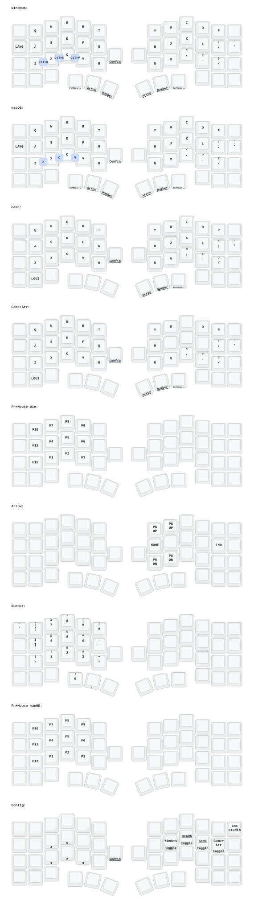

# Cornix ZMK Firmware

Cornix 분할 키보드를 위한 개인용 ZMK 펌웨어 저장소입니다. 기본 구성은 동글 없이 왼쪽 키보드를 PC에 Bluetooth 또는 USB로 직접 연결하고, 오른쪽 키보드는 왼쪽 키보드에 무선으로 연결하는 방식입니다.

## 주요 특징

- 왼쪽을 central, 오른쪽을 peripheral로 사용하는 무선 분할 구성
- 왼쪽과 오른쪽 모두 nRF52840 최대 송신 출력인 `+8 dBm` 적용
- PC 직접 연결 시 7.5ms BLE 연결 간격, latency 0 및 안정적인 1M PHY 사용
- 키보드에서 마우스 이동, 스크롤 및 버튼 입력 지원
- 좌우 EC11 인코더 지원
- Config 레이어에서 Windows, macOS, Game 레이어를 배타적으로 전환
- 키 조합을 통한 좌우 개별 UF2 부트로더 진입
- SoftDevice를 사용하지 않는 no-SD 플래시 레이아웃
- GitHub Actions를 통한 펌웨어 빌드, 릴리즈 및 키맵 다이어그램 자동 생성

## 빠른 설치

1. [최신 Release](https://github.com/thsrhwk01/zmk-keyboard-cornix/releases/latest)에서 펌웨어 ZIP을 내려받습니다.
2. 동글 없이 사용할 경우 다음 두 파일을 준비합니다.
   - 왼쪽: `cornix_left_default_nosd.uf2`
   - 오른쪽: `cornix_right_nosd.uf2`
3. 각 키보드를 UF2 부트로더 모드로 진입시킨 뒤 해당 파일을 마운트된 드라이브에 복사합니다.
4. 양쪽 키보드의 전원을 켜고 PC의 Bluetooth 설정에서 `Cornix`를 선택합니다.

아직 Release가 없다면 [Build ZMK firmware](https://github.com/thsrhwk01/zmk-keyboard-cornix/actions/workflows/build.yml) workflow의 최신 성공 실행에서 `firmware` artifact를 내려받을 수 있습니다.

## UF2 파일 선택표

| 파일 | 대상 | 용도 |
| --- | --- | --- |
| `cornix_left_default_nosd.uf2` | 왼쪽 | 동글 없이 PC에 직접 연결할 때 사용하는 기본 펌웨어 |
| `cornix_right_nosd.uf2` | 오른쪽 | 오른쪽 키보드용 펌웨어 |
| `cornix_dongle_nosd.uf2` | 동글 | 선택적인 전용 동글용 펌웨어 |
| `cornix_left_for_dongle_nosd.uf2` | 왼쪽 | 전용 동글을 사용할 때의 왼쪽 peripheral 펌웨어 |
| `cornix_reset.uf2` | Cornix | Bluetooth 페어링 및 저장 설정 초기화용 |
| `reset_nicenano_nosd.uf2` | 동글 | nice!nano 기반 동글의 저장 설정 초기화용 |

일반적인 펌웨어 업데이트에는 reset 파일이 필요하지 않습니다. 좌우 연결이나 Bluetooth 페어링을 새로 구성해야 할 때만 사용하십시오.

## 부트로더 진입

처음 ZMK 펌웨어를 설치하거나 키를 통한 진입이 작동하지 않을 때는 USB 데이터 케이블을 연결하고 해당 키보드의 RESET 버튼을 빠르게 두 번 누릅니다.

이 저장소의 펌웨어가 설치된 뒤에는 Config 레이어에서 다음 키를 사용할 수 있습니다.

| 키 조합 | 동작 |
| --- | --- |
| `Config + T` | 왼쪽 키보드를 UF2 부트로더로 전환 |
| `Config + Y` | 오른쪽 키보드를 UF2 부트로더로 전환 |

부트로더 동작은 키를 누른 쪽에서만 실행됩니다. 오른쪽 펌웨어를 설치할 때는 오른쪽 키보드에 USB 데이터 케이블을 연결한 상태에서 `Config + Y`를 누르십시오.

## 키맵과 레이어

키맵 원본은 [`config/cornix.keymap`](config/cornix.keymap)입니다.

| 번호 | 레이어 | 용도 |
| ---: | --- | --- |
| 0 | Windows | Windows용 기본 레이어와 홈 로우 모드 |
| 1 | macOS | macOS용 기본 레이어와 Command/Option 배열 |
| 2 | Game | 홀드-탭을 줄인 게임용 레이어 |
| 3 | Game+Arr | 오른손에 방향키를 배치한 게임용 레이어 |
| 4 | Fn+Mouse | Windows용 기능키, 마우스 이동·버튼·스크롤 |
| 5 | Arrow | 방향키, 탐색 및 편집 기능 |
| 6 | Number | 숫자와 기호 입력 |
| 7 | Fn+Mouse | macOS용 기능키, 마우스 이동·버튼·스크롤 |
| 8 | Config | Bluetooth 프로필, 출력 전환, 레이어 선택, 부트로더 및 ZMK Studio |

Config 레이어에서 `&to`를 사용해 0~3번 레이어를 선택하므로, 기존에 활성화된 상위 레이어가 남지 않고 선택한 레이어 하나로 전환됩니다.

왼쪽 인코더는 기본·게임·Config 레이어에서 볼륨, Fn+Mouse 레이어에서 화면 밝기, Arrow·Number 레이어에서 이전/다음 동작을 수행합니다. 오른쪽 인코더는 모든 레이어에서 Page Up/Page Down으로 동작합니다.

키맵을 변경해 push하면 GitHub Actions가 아래 다이어그램을 자동으로 다시 생성합니다.

다이어그램은 [keymap-drawer](https://github.com/caksoylar/keymap-drawer)로 생성됩니다.

## 라이선스

이 저장소는 [Apache License 2.0](LICENSE)에 따라 배포됩니다. ZMK와 포함된 외부 프로젝트 및 자산에는 각 프로젝트의 라이선스가 적용됩니다.
